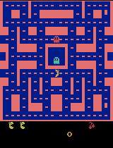
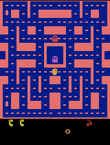
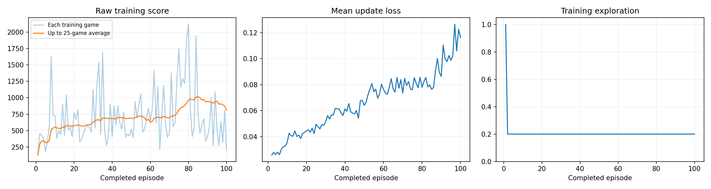

# Training a Ms. Pac-Man Agent (Class 3)

An agent learns to play Atari Ms. Pac-Man by trial and error, using the ready-made Deep Q-Network (DQN) notebook from [pepealonso95/pacman-dqn](https://github.com/pepealonso95/pacman-dqn). I chose three settings, trained for 100 games, and tested the agent on the same five games before and after training.

**Headline result: the agent clearly improved during practice (average game score rose from 566 to 813), but it scored *worse* on the five official test games (492 → 358, a change of −134).** Both findings are reported below.

## 1. How to open and run the notebook

1. Open [pacman_dqn.ipynb](pacman_dqn.ipynb) in Google Colab (**File → Upload notebook**, or use the [starter version](https://colab.research.google.com/github/pepealonso95/pacman-dqn/blob/main/pacman_dqn.ipynb)).
2. Choose **Runtime → Change runtime type → T4 GPU** and save.
3. In section 1, set `EXPLORATION = 0.20`, `EPISODES = 100`, `LEARNING_RATE = 0.0001`. Change nothing else.
4. Choose **Runtime → Run all**. Setup, the before-training test, training, the after-training test, and the results ZIP all run in order.
5. Download the results ZIP before the Colab session ends.

## 2. My three settings

*(Reasons written before training started.)*

| Setting | Value | Why I chose it |
|---|---|---|
| Exploration | **0.20** | How often the agent ignores its own judgment and tries a random move. I kept the notebook's reference value: 20% random moves keeps it discovering new routes through the maze, while 80% of the time it uses what it has learned. The rate stays fixed after the first 1,000 random warm-up moves, so the run is easy to compare against others. |
| Episodes (practice games) | **100** | How many games it practices on. 100 is the notebook's starting value and a fair first experiment: long enough to clear the warm-up and make tens of thousands of learning updates, and it saves progress recordings at games 25, 50, 75 and 100, but short enough to finish in one Colab session. |
| Learning rate | **0.0001** | How big a change the agent makes each time it learns. I used the suggested starting point. Small steps learn more slowly but are far more stable; larger steps risk overreacting to a single lucky or unlucky game and unlearning what already worked. |

All other settings were left unchanged, including the evaluation settings: the same five seeds (101, 202, 303, 404, 505), 5% random moves, and the same 3,000-move time limit before and after training. The only value I touched temporarily was `EPISODES = 5`, for a short setup check that confirmed the notebook ran on the GPU. That check is not the submitted run.

## 3. What I expected vs. what I observed

**What I expected (written before training):**

A modest improvement, not a good Pac-Man player. 100 games is very little practice for an Atari game, and the agent first learns simple habits like "keep moving and eat nearby dots" rather than real ghost avoidance. Specifically, I predicted a small gain in the test average, uneven individual scores, a noisy training curve trending upward, possibly falling prediction error without better play, and a real chance of no improvement at all.

**What I observed:**

- **During practice, it improved.** The average score across practice games rose from **565.6** (games 1–25) to **812.8** (games 76–100), peaking at a 25-game average of **1,016** around game 85. Its best single practice game was **2,120** points.
- **On the official test, it got worse:** **492 → 358**, a change of **−134**. My prediction of a modest gain was wrong in the direction that matters for grading.
- **The two tests disagree because of how they differ.** Practice games use different game setups and 20% random moves; the test uses five fixed setups and 5% random moves. On the one setup that appears in both (seed 101), the agent improved steadily: **110 → 200 → 380 → 390** points at games 25, 50, 75 and 100, and in the official test that same game went **350 → 390**. Four of the five test games fell, and most of the drop comes from test game 4, where the untrained network happened to score 800.
- **Prediction error rose rather than fell.** This is normal early in this kind of learning: as the agent discovers that points exist, its predicted values grow, so there is more to be wrong about. It confirms that loss and score are separate things.
- **In the gameplay,** the trained agent looks more intent on eating dots than the untrained one, which wanders more aimlessly. But the trained agent still has moments where it stops in a corner and stays there.

## 4. Training budget (what actually ran)

| Item | Value |
|---|---|
| Run status | completed (not interrupted) |
| Completed episodes | 100 of 100 requested |
| Total decisions (moves) | 62,251 |
| Learning updates | 15,313 |
| Elapsed time | 265 seconds (4.4 minutes), including the periodic demo recordings |
| Hardware | Google Colab, NVIDIA T4 GPU (CUDA), Linux x86-64 |
| Software | Python 3.13.15, PyTorch 2.11.0+cu128, Gymnasium 1.3.0, ale-py 0.11.2 |

The first 1,000 decisions were random warm-up with no learning, which is why episode 1 has no loss value in [training.csv](results/training.csv).

## 5. Before vs. after scores

Both tests use the **untrained network** as the baseline (not a random player) with identical settings: the same five seeds, 5% random moves, and the same time limit. No game hit the time limit.

| Game (seed) | Before training | After training |
|---|---|---|
| 1 (101) | 350 | 390 |
| 2 (202) | 500 | 340 |
| 3 (303) | 320 | 310 |
| 4 (404) | 800 | 400 |
| 5 (505) | 490 | 350 |
| **Mean** | **492.0** | **358.0** |
| **Change in mean** | | **−134.0** |

Full results: [results/comparison.json](results/comparison.json) · baseline only: [results/baseline.json](results/baseline.json)

Five games is a small sample, so neither number is a reliable estimate of true skill. The honest summary is that this training run did not improve test performance.

## 6. Gameplay

Each notebook GIF shows at most the first 20 seconds of a game, sped up 4×. The score shown on screen is therefore partway through the game, not the final score.

**Before training (untrained agent, seed 101, final score 350):**

**Progress during training** (same setup each time, seed 101) — scores 110, 200, 380, 390:

| After 25 games | After 50 games | After 75 games | After 100 games |
|---|---|---|---|
|  |  |  |  |

**Best trained game** (highest of the five test games: seed 404, final score 400):

**Supplementary: complete games, start to game over.** The notebook only records the first 20 seconds, so I replayed the saved checkpoints locally with the identical evaluation settings and recorded the whole game. They reproduce the official scores exactly (350 in 560 moves, 400 in 518 moves): [untrained, full game](results/demos/full_game/untrained_full_game.gif) · [best trained, full game](results/demos/full_game/trained_full_game.gif).

## 7. Training dashboard

- **Left (score per practice game):** the pale line is each game, the orange line is the average of the last 25 games. It climbs from about 200 to about 810, peaking near 1,016 around game 85, and the overall average across all 100 games was 721.
- **Middle (prediction error):** it rises through the run rather than falling. Lower loss would not have guaranteed better play, and here higher loss did not prevent better practice scores either.
- **Right (exploration):** 1.0 during the 1,000-move random warm-up, then flat at the chosen 0.20 for the rest of training, exactly as configured.

## 8. How the agent works (plain language)

- **What it observes:** the last **four game screens**, shrunk to small black-and-white images. Four in a row let it tell which way Ms. Pac-Man and the ghosts are moving.
- **What it can do (actions):** pick one **joystick move** per turn, from nine options: stay still, the four straight directions, and the four diagonals.
- **What it is rewarded for:** **game points**, for dots, power pellets, fruit and ghosts. During learning each reward is simplified to +1, but every score reported here is the real game score.
- **How it learns:** it starts by moving randomly to gather experience, then mostly picks the move it predicts will lead to the most points, still choosing randomly 20% of the time. It repeatedly replays past moments from memory and nudges its predictions toward what actually happened.

## 9. One limitation and my next experiment

**One limitation I observed:** the trained agent sometimes stops in a corner and stays there. It has learned to chase nearby dots, but not what to do once the easy dots around it are gone, and with only nine joystick moves and no sense of the maze layout it has no plan for crossing the board. This idling wastes the time limit and is part of why its test scores are lower, despite better practice scores.

A second limitation worth naming: the test is only five games. A single lucky baseline game (800 points on seed 404) moves the average by a lot, so this comparison cannot firmly separate "the agent got worse" from "the baseline got lucky."

**My next experiment:** change only **episodes**, from **100 to 300**, keeping exploration at 0.20 and the learning rate at 0.0001. The training curve was still rising at game 100, and the tracked test game improved steadily throughout (110 → 390), so the run looks under-trained rather than mis-tuned. The whole run took 4.4 minutes, so 300 games easily fits in one Colab session. If the corner-stopping persists after 300 games, the setting I would change after that is exploration, lowering it to 0.10 so more of the practice is spent using what it has learned.

## 10. Files and evidence

- Executed notebook, final run with all outputs: [pacman_dqn.ipynb](pacman_dqn.ipynb)
- Settings, hardware and package versions: [results/config.json](results/config.json)
- Per-game training log: [results/training.csv](results/training.csv)
- Training summary: [results/training_summary.json](results/training_summary.json)
- Before/after comparison: [results/comparison.json](results/comparison.json)
- Baseline scores: [results/baseline.json](results/baseline.json)
- Progress demo scores: [results/demo_scores.json](results/demo_scores.json)
- Training dashboard: [results/training_dashboard.png](results/training_dashboard.png)
- Gameplay GIFs: [results/demos/](results/demos)
- Model checkpoints (untrained, games 25/50/75/100, final) and the complete results ZIP: [TODO: GitHub Release link]. They are about 39 MB in total, so they are attached to a release rather than committed to the repository.
